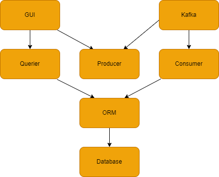
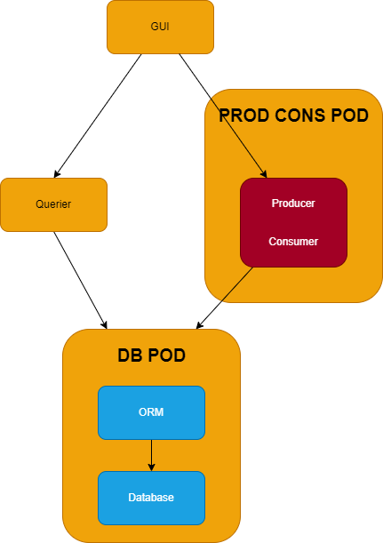

# Multiple-containers-in-pod

## About the project:  

The original [project](https://github.com/davidswisa/microservices-example) is simple reservation application uses a queue manager for all reservation tasks like create, update, and delete.
And use a more direct approach to get the data from the DB.  

In this project we wanted to explore a more complex `POD` soche as multi container `PODS` and multi process container.   

### Comparisons  

### Simple POD Diagram  

In this example each `POD` have a single container and each container has a single process

  

### Complex POD Diagram  

In this example we have two use cases multi container `PODS` (ORM and DB) and multi process container (producer consumer).

  

### Service Table
| Container | Port | Purpose  |
| :---      | :-   | :- |
| ui        | 8084 | gui |
| cons prod     | 8080   | prod: receive http request from ui and create messages (tasks) via a socket </br>cons: get messages (tasks) from prod and forwards to orm |
| orm       | 5431 | used as a mitigator for DB |
| querier   | 8081 | receive http request from ui and forwards a query via orm |
| db        | 5432 | data base |


## Prerequisite:

### K3S:

In order to simplify the containers build process we decided to use `kubernetes`.  
The `k3s` is a lite wait kubernetes with docker as the container runtime.  


To install `k3s`:  
``` bash
curl -sfL https://get.k3s.io | sh -s - --docker
```

Configure local kubctl to work with container k3s  

``` bash  
echo "export KUBECONFIG=/etc/rancher/k3s/k3s.yaml" >> ~/.bashrc
```

Load the config
``` bash  
exec bash
```

## Getting Started:

Get the source code:
```bash
git clone git@github.com:davidswisa/multiple-containers-in-pod.git
```

To run the services:  

```bash
make run
```

Now you can open the UI using this link:  

```html
http://<MACHINE-IP>:8084
```

## How can be extended:  

* can add upgrade flow for a new pod version
* can be a base for helm charts project  


## For further reading:  

* [Kubernetes multi-container pods and container communication](https://www.mirantis.com/blog/multi-container-pods-and-container-communication-in-kubernetes/)  
* [Multi-Container Pods in Kubernetes](https://linchpiner.github.io/k8s-multi-container-pods.html)
* [Understanding multi-container pods](https://medium.com/bb-tutorials-and-thoughts/understanding-multi-container-pods-12f5780f3956)

